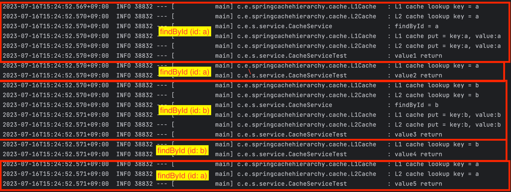

# Spring Cache 로 캐시 계층 구조 사용하기

## 메모리 계층 구조

- 메모리를 필요에 따라 여러 가지 종류로 나누어 둠을 의미한다.
- 이떄 필요한 대부분의 경우는 CPU가 메모리에 더 빨리 접근하기 위함이다.

## 자주 쓰는 데이터는 계속 자주 쓰인다.
- 자주 쓰이는 데이터는 계속 자주 쓰이고, 자주 쓰이지 않는 데이터는 계속 자주 쓰이지 않는다.
- 자주 쓰이으는 데이터는 전체 데이터 양에 비해 작은 양이기 때문에, 캐시는 메모리보다 더 작아도 된다.
- 컴퓨터 과학에서 증명된 법칙이며, 지역성의 원리라고도 한다.


## Spring Cache로 캐시 계층 구조 사용하기
Spring에서는 Cache 추상화를 통해 다양한 캐시 솔루션을 일관성있게 사용할 수 있게 한다.   
트랜잭션과 마찬가지로, AOP를 이용해 특정 캐시 기술에 종송되지 않고 캐시 기능을 투명하게 적용할 수 있다.

### CacheManager 구현체
스프링에서 제공하는 CacheManager 구현체는 아래와 같다.   
- CaffeineCacheManager
- CompositeCacheManager
- ConcurrentMapCacheManager
- JCacheCacheManager
- NoOpCacheManager
- SimpleCacheManager


### 의존성 추가
```shell
implementation 'org.springframework.boot:spring-boot-starter-cache'
```


### @EnableCaching 추가
SpringBoot 에서 Cache 추상화를 사용하기 위해 해당 어노테이션을 추가한다.
```java
@EnableCaching
@SpringBootApplication
public class SpringCacheHierarchyApplication {

	public static void main(String[] args) {

		SpringApplication.run(SpringCacheHierarchyApplication.class, args);
	}

}
```

### L1, L2 Cache 추가
여기서는 캐시 계층 구조가 제대로 동작하기 위해 메모리 기반의 `SimpleCacheManager` 를 확장하여 사용한다.
메모리 캐시에서 데이터가 get이나 put 될 때, 로그를 남기도록 설정하였다.   
`ConcurrentMapCache` 캐쉬는 내부적으로 `ConcurrentMap` 을 사용하여 캐시를 관리하는데 `ConcurrentMap` 의 capacity를 고정하기 어려워
put 할 때 마다, `clear()` 메서드를 호출하였다. capacity가 1이고 FIFO 방식으로 교체하는 캐시라고 생각하면 편하다.

```JAVA

@Slf4j
public class L1Cache extends ConcurrentMapCache {


	@Override protected Object lookup(final Object key) {
		log.info("L1 cache lookup key = {}", key);
		return super.lookup(key);
	}
	
	@Override public void put(final Object key, final Object value) {
		super.clear();
		log.info("L1 cache put = key:{}, value:{}", key, value);
		super.put(key, value);
	}
	
}
```


```java
package com.example.springcachehierarchy.cache;

import java.util.concurrent.Callable;
import java.util.concurrent.ConcurrentMap;
import lombok.extern.slf4j.Slf4j;
import org.springframework.cache.concurrent.ConcurrentMapCache;
import org.springframework.core.serializer.support.SerializationDelegate;

@Slf4j
public class L2Cache extends ConcurrentMapCache {


	@Override protected Object lookup(final Object key) {
		log.info("L2 cache lookup key = {}", key);
		return super.lookup(key);
	}
	
	@Override public void put(final Object key, final Object value) {
		log.info("L2 cache put = key:{}, value:{}", key, value);
		super.put(key, value);
	}
}
```

### L1, L2 Cache Bean 등록
위에서 만든 L1, L2 Cache 를 `SimpleCacheManager`의 구현체로 @Bean 으로 등록한다.

```java
@Configuration
public class CacheConfig {
	
	@Primary
	@Bean("l1CacheManager")
	public CacheManager l1CacheManager() {
		final var simpleCacheManager = new SimpleCacheManager();
		simpleCacheManager.setCaches(List.of(new L1Cache("Cache")));
		return simpleCacheManager;
	}


	@Bean("l2CacheManager")
	public CacheManager l2CacheManager() {
		final var simpleCacheManager = new SimpleCacheManager();
		simpleCacheManager.setCaches(List.of(new L2Cache("Cache")));
		return simpleCacheManager;
	}
}

```

### CacheService

```JAVA
@Slf4j
@Service
public class CacheService {

	@Caching(cacheable =
        {
            @Cacheable(cacheManager = "l1CacheManager", cacheNames = "L1Cache"),
            @Cacheable(cacheManager = "l2CacheManager", cacheNames = "L2Cache")
        }

	)
	public String findById(String id) {
		log.info("findById = {}", id);
		return id;
	}
	
}
```

`@Caching` 어노테이션의 `cacheable` 필드는 `@Cacheable` 어노테이션의 배열을 인자로 받는다.   
첫번째 `@Cacheable` 어노테이션의 `cacheManager` 는 `l1CacheManager` 로 설정하고   
두번쨰 `@Cacheable` 어노테이션읜 `cacheManager` 는 `l2CacheManager` 로 설정한다.   
내가 기대하는 것은 `l1CacheManager` 에 key 값에 캐시가 없다면 `l2CacheManager` 로 값을 탐색하고,   
`l2CacheManager` 도 없다면 `findById` 메서드가 호출되는 것이다. 테스트 코드로 검증을 해보자.


### CacheService 캐시 계층 구조 테스트
테스트 코드를 짜고, 로그를 통해 동작을 확인해보자.
```java
@Slf4j
@SpringBootTest
class CacheServiceTest {

	@Autowired CacheService cacheService;

	@Test
	void CacheService_캐시_동작_테스트(){

		final var value1 = cacheService.findById("a");
		log.info("value1 return");

		final var value2 = cacheService.findById("a");
		log.info("value2 return");

		final var value3 = cacheService.findById("b");
		log.info("value3 return");

		final var value4 = cacheService.findById("b");
		log.info("value4 return");

		final var value5 = cacheService.findById("a");
		log.info("value5 return");
	}

}
```

1. `findById (id:a)` 호출 시, L1, L2 캐시 모두 Cache Miss 로 서비스 메서드가 호출되었다. 메서드가 호출되고 L1, L2 캐시 모두 호출 결과가 캐싱되었다.
2. `findById (id:a)` 호출 시, L1 캐시에 id:a 이 있으므로, Cache Hit 되었다.
3. `findById (id:b)` 호출 시, id:2가 L1, L2 캐시에 없으므로 서비스 메서드가 호출되었다. 결과가 캐싱되고, L1 캐시는 capacity가 1이므로 id:b 가 캐싱되어 있을 것이다.
4. `findById (id:b)` 호출 시, L1 캐시에 id:b 이 있으므로, Cache Hit 되었다.
5. `findById (id:a)` 호출 시, L1 캐시에서 Cache Miss로 L2 캐시에서 Cache Hit 되었다.

로그를 통해 내가 의도한대로 동작되는 것을 확인할 수 있다. 


## Local Cache 와 Redis로 L1, L2 캐시 계층 구성하기
L1 계층의 캐시는 SimpleCacheManager 그대로 사용하고, L2 계층의 캐시를 Redis로 마이그레이션 한다.
서버 인스턴스가 여러대 인 경우, L1 계층인 로컬 캐시와 L2 계층의 Redis 캐시가 일관성이 꺠질 수 있으므로 
Redis pub/sub을 사용하여 로컬 캐시와 Redis 캐시의 일관성을 유지하도록 한다.


### Redis 설정
```JAVA
@Configuration
public class RedisConfig {

	@Bean
	public RedisMessageListenerContainer RedisMessageListener(RedisConnectionFactory connectionFactory) {
		RedisMessageListenerContainer container = new RedisMessageListenerContainer();
		container.setConnectionFactory(connectionFactory);
		return container;
	}

	@Bean
	public RedisTemplate<String, Object> redisTemplate(RedisConnectionFactory connectionFactory) {
		RedisTemplate<String, Object> redisTemplate = new RedisTemplate<>();
		redisTemplate.setConnectionFactory(connectionFactory);
		redisTemplate.setKeySerializer(new StringRedisSerializer());
		redisTemplate.setValueSerializer(new StringRedisSerializer());
		return redisTemplate;
	}
}
```

### Redis MessageListener 설정
```JAVA
@Slf4j
@Service
@RequiredArgsConstructor
public class RedisMessageListener implements MessageListener {

	private final RedisTemplate<String, Object> redisTemplate;
	private final List<CacheManager> cacheManagerList;
	private final RedisMessageListenerContainer redisMessageListenerContainer;

	@PostConstruct
	private void init() {
		redisMessageListenerContainer.addMessageListener(this, new ChannelTopic("Cache"));
	}


	@Override public void onMessage(final Message message, final byte[] pattern) {
		final var evictKey = new String(message.getBody(), StandardCharsets.UTF_8);

		for (final CacheManager cacheManager : cacheManagerList) {
			cacheManager.getCache("Cache").evict(evictKey);
		}
	}
}
```

### Redis CacheManager 설정
```JAVA

@Configuration
@RequiredArgsConstructor
public class CacheConfig {

	private final RedisConnectionFactory connectionFactory;
	
	// l2RedisCacheManager bean 추가
	@Bean("l2RedisCacheManager")
	public CacheManager redisCacheManager() {
		RedisCacheConfiguration redisCacheConfiguration = RedisCacheConfiguration.defaultCacheConfig()
				.serializeKeysWith(RedisSerializationContext.SerializationPair.fromSerializer(new StringRedisSerializer()))
				.serializeValuesWith(RedisSerializationContext.SerializationPair.fromSerializer(new StringRedisSerializer()));

		return RedisCacheManager.RedisCacheManagerBuilder
				.fromConnectionFactory(connectionFactory)
				.cacheDefaults(redisCacheConfiguration)
				.build();
	}
}

```

### CacheService @Cacheable 설정변경
```java
@Slf4j
@Service
public class CacheService {

	@Caching(cacheable =
      {
            @Cacheable(cacheManager = "l1CacheManager", cacheNames = "Cache"),
            @Cacheable(cacheManager = "l2RedisCacheManager", cacheNames = "Cache")
      }
	)
	public String findById(String id) {
		log.info("findById = {}", id);
		return id;
	}

}
```

위의 코드를 추가한 후, 첫번쨰 테스트 코드를 다시 돌려보자.
redis에 접속해서 `keys *` 명령어로 확인해보면 `Cache::a`, `Cache::b` 키값이 잘 들어가 있는 것을 볼 수 있다.

Redis Pub/Sub 으로 캐시값이 evict되면 로컬캐시와 redis캐시에 잘 반영되는지 테스트 코드로 검증해보자

```JAVA
@Slf4j
@SpringBootTest
class CacheServiceTest {

	@Autowired List<CacheManager> cacheManagerList;
	@Autowired RedisTemplate<String, Object> redisTemplate;

	@Test
	@DisplayName("Reids Topic에 subscribe이 발생하면 해당 키가 l1, l2 캐시에서 evict 된다")
	void redis_pub_sub_cache_evict_테스트() throws InterruptedException {

		// given
		var topic = "Cache";
		var key = "key1";
		var value = "value1";

		for (final CacheManager cacheManager : cacheManagerList) {
			cacheManager.getCache(topic).put(key, value);
			Assertions.assertEquals(value, cacheManager.getCache(topic).get(key).get());
		}

		// when
		redisTemplate.convertAndSend(topic, key);
		Thread.sleep(1000L); // 캐시 무효화 메시지가 subscribe 될때까지 기다린다

		// then
		for (final CacheManager cacheManager : cacheManagerList) {
			Assertions.assertNull(cacheManager.getCache(topic).get(key));
		}

	}
}
```


### 정리
여기서는 2차 캐시인 redis에 데이터가 변경된다면 redis pub/sub을 key 값을 이용해서 변경된 데이터를 무효화하였다.
필요에 따라 pub/sub 시 key,value를 한 메시지에 담아서 보내서 캐시가 새 값으로 교체되는 정책을 적용할 수 도 있다.   
Redis에 대량의 데이터가 적재되어 로컬 캐시에 모두 담을 수 없는 경우 또는 서버 인스턴스 메모리를 세심하게 관리해야 되는 경우
Ehcache 같은 캐시 라이브러리와 Redis를 함께 사용해서 낮은 레이턴시를 유지하면서도 메모리 관리도 효율적으로 할 수 있을 것 이다.
다만, 캐시 값이 변경되면 캐시 일관성을 위해 각 계층에 동기화하는 오버헤드가 발생하므로, 자주 변하지 않는 데이터로 캐시 계층을 구성해야 한다.
